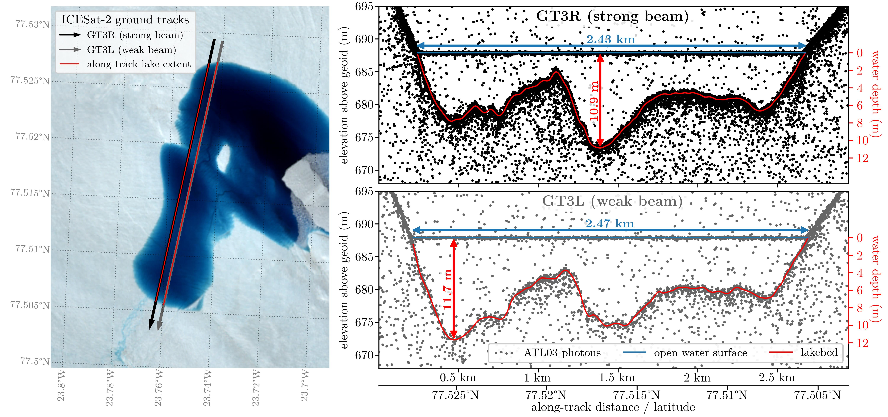
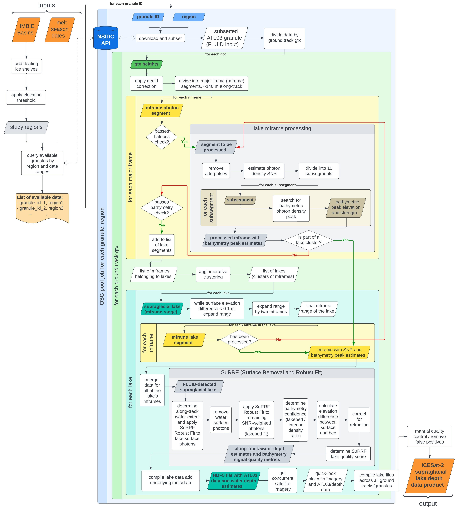
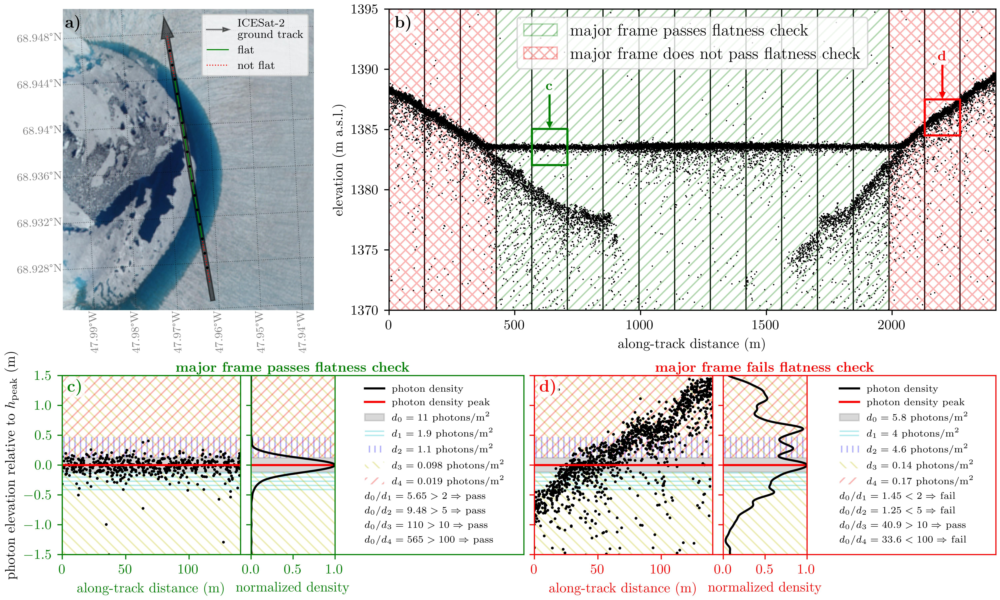
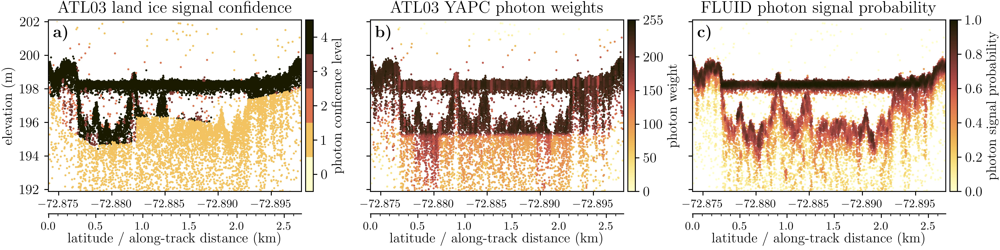
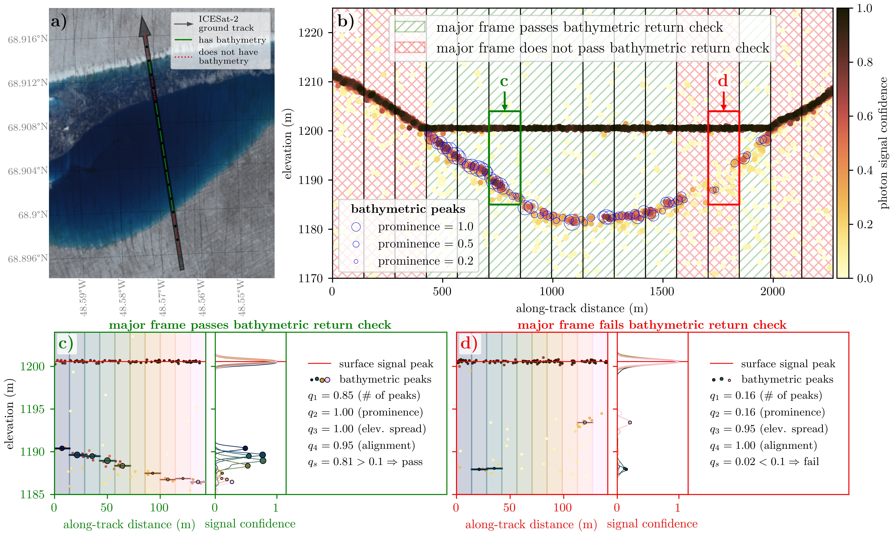
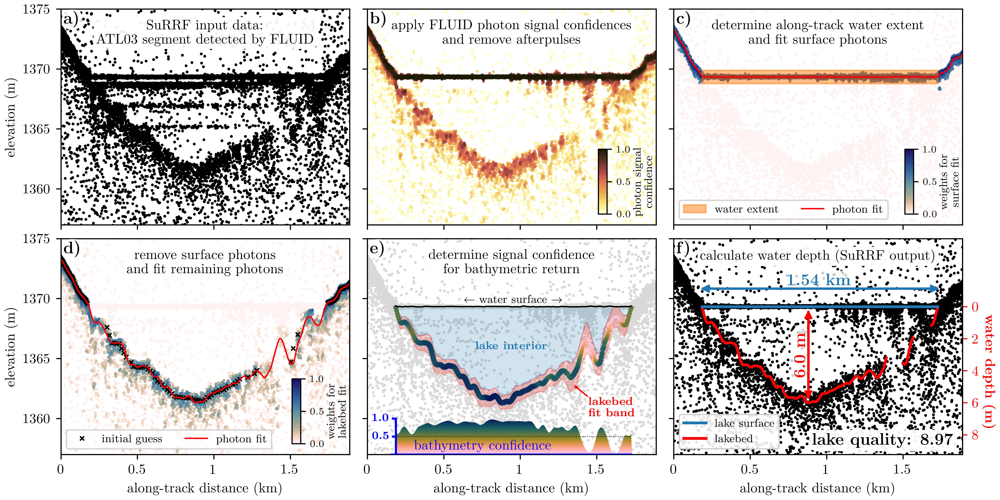
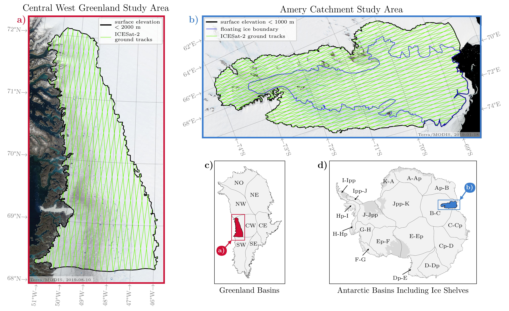
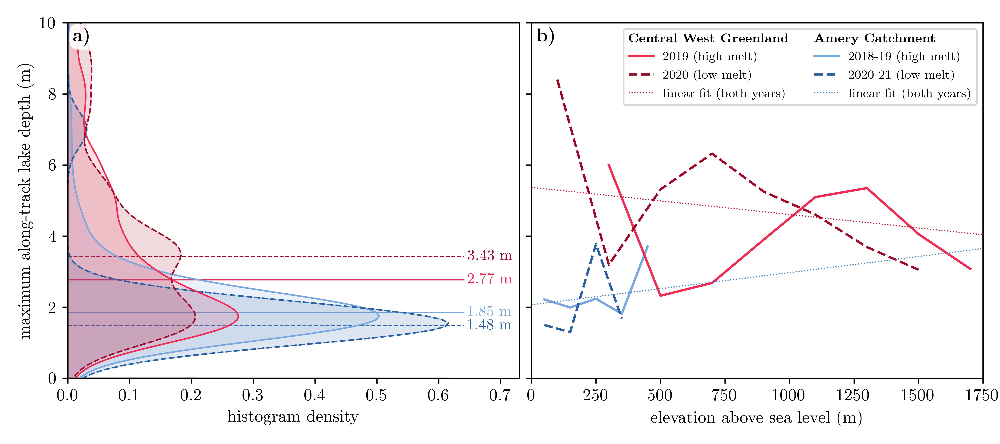
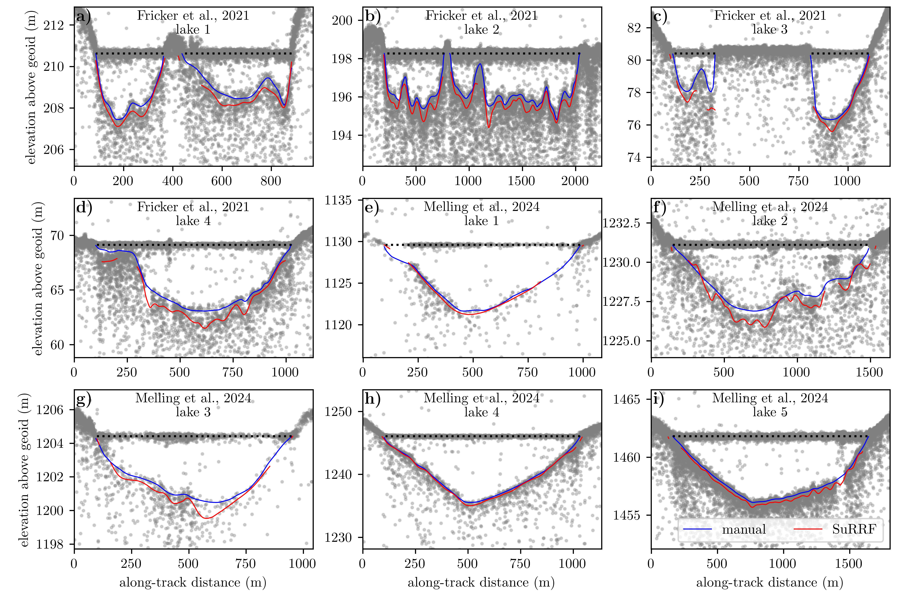

# Data and Code For FLUID-SuRRF Figures
For automatic supraglacial lake detection and depth determination in ICESAat-2 ATL03 data. 

## Fig. 1
notebook: [fig1-IS2-imagery-example.ipynb](fig01-ICESat2-imagery-example/fig1-IS2-imagery-example.ipynb)

ICESat-2 ATL03 data over a supraglacial lake, showing a particularly strong bathymetric signal. (Data from ICESat-2 Track 406 on 20 July 2021; granule: ATL03\_20210720053125_04061205_006_01.h5. The imagery in the left panel is a Sentinel-2 scene from the same day: S2B_MSIL2A_20210720T151809_N0301_R068_T27XVG_20210720T175839)

## Fig. 2
made in [lucid](https://lucid.app/lucidchart/f86a9d24-7c33-4b07-829b-20f1b310e198/edit?viewport_loc=-4446%2C-360%2C6086%2C2602%2C0_0&invitationId=inv_ba6f5e48-edd5-4af5-a737-e423cf8edf99).

Flowchart of the FLUID/SuRRF framework for detecting and determining the depths of supraglacial melt lakes in ICESat-2 data for any melt season over any drainage basin of the Antarctic or Greenland ice sheets. All modules in the blue box can be parallelized for large amounts of input data granules, as a batch of compute jobs on a platform for distributed High-Throughput Computing, such as the OSG Open Science Pool.

## Fig. 3
notebook: [fig3-flatness-check.ipynb](fig03-flatness-check/fig3-flatness-check.ipynb)

FLUID “flatness check” applied to every ATL03 major frame for identifying  potential supraglacial lakes. a) Ground track of an along-track segment of ATL03 data over the GrIS, with a partially ice-covered supraglacial lake; b) Corresponding along-track photon elevations, with major frame boundaries marked by vertical black lines and flatness check outcomes shown in hatching; c) and d) Photon density ratios for a passing and a failing segment, respectively. (Data from ICESat-2 Track 216 GT1L on 12 July 2019 and centered at 68.9370° N, 47.9657° W; granule: ATL03_20190712052659_02160403_006_02.h5, imagery: Sentinel-2 on 2019-07-13)

## Fig. 4
notebook: [fig4-afterpulses.ipynb](fig04-afterpulses/fig4-afterpulses.ipynb)

FLUID afterpulse removal. (a) to (c): Histogram of photon elevations in saturated pulses over melt lakes, relative to the elevation at which saturation occurred. The secondary peaks that appear below the saturated surface return are afterpulses that are caused by (a) dead-time of the ATLAS sensor; (b) internal reflections in the instrument; and (c) PMT ionization. Note that (a), (b) and (c) have different vertical scales. d) to h): Implementation of FLUID’s afterpulse removal for a short along-track segment of ATL03 data that contains a supraglacial lake with sections of highly saturated (specular) pulses. Known locations of ATLAS afterpulses (a) to (c) are used to remove likely afterpulse photons. (ICESat-2 track 1222 gt2l on Jun 17, 2019 and centered at 69.0189° N, 49.0444° W; granule: ATL03_20190617064249_12220303_006_02.h5)

## Fig. 5
notebook: [fig5-density-signal-confidence.ipynb](fig05-density-signal-confidence/fig5-density-signal-confidence.ipynb)

A comparison between existing photons signal confidence estimates and our method for melt lakes. (Data from  ICESat-2 Track 81 GT2L on 2 January 2019 and centered at 72.8859° S, 67.3082° E; granule: ATL03_20190102184312_00810210_006_02.h5)

## Fig. 6
notebook: [fig6-bathymetry-check.ipynb](fig06-bathymetry-check/fig6-bathymetry-check.ipynb)

FLUID’s bathymetric signal check run on every ATL03 major frame that has passed the flatness check. a) Ground track for an along-track segment of ATL03 data over the GrIS, which contains a supraglacial lake that has a thin partial ice cover near its northern shore. b) Corresponding along-track photon elevations, and locations of detected bathymetric photon density peaks. The vertical black lines are the major frame boundaries, and hatching indicates whether major frames passed the bathymetric signal check or not. c) and d) Bathymetric peak-finding procedure from photon density and associated values of the bathymetric return quality heuristics defined in the text, for a passing and a failing major frame, respectively. (ICESat-2 track 277 gt3r on Jul 16, 2019 and centered at 68.9062° N, 48.5689° W; granule: ATL03_20190716051841_02770403_006_02.h5, imagery: Sentinel-2 on 2019-07-16)

## Fig. 7
notebook: [fig07-surf-explainer.ipynb](fig07-surrf-explainer/fig07-surf-explainer.ipynb)

SuRRF algorithm for determining supraglacial lake depth from an along-track segment of ATL03 data that was detected by FLUID. (ICESat-2 track 277 gt2l on 13 July 2020 and centered at 68.1923° N, 48.5134° W; granule: ATL03_20200713115804_02770803_006_01.h5)

## Fig. 8
notebook: [fig8-study-regions.ipynb](fig08-study-regions/fig8-study-regions.ipynb)

Study regions for testing FLUID/SuRFF algorithm. a) and b) Maps of the two regions chosen for this study. The black outlines show the boundaries of the regions which were obtained by thresholding the corresponding ice sheet drainage basins (c and d) by the elevations shown in the legends. The green lines show ICESat-2 reference ground track coverage.

## Fig. 9
notebook: [figs9-10-results-maps.ipynb](fig09-10-results-maps/figs9-10-results-maps.ipynb)

Center maps: FLUID/SURFF algorithm testing in Greenland. Locations of melt lakes detected in ATL03 data for the Greenland Ice Sheet's Central West drainage basin for melt seasons 2019 and 2020, mapped over the corresponding seasons' maximum meltwater extent from Landsat 8. a)-j): Examples showing the underlying ATL03 photon clouds and water depths calculated by SuRRF, for some of the lakes shown on the maps. Numbers in lower right of panels are SuRFF lake quality scores.

## Fig. 10
notebook: [figs9-10-results-maps.ipynb](fig09-10-results-maps/figs9-10-results-maps.ipynb)

Center maps: FLUID/SuRFF algorithm testing in Antarctica. Locations of melt lakes that FLUID detected in ATL03 data for the Antarctic Ice Sheet's B-C drainage basin for melt seasons 2019-20 and 2020-21, mapped over the corresponding seasons' maximum meltwater extent from Landsat 8. Panels a-j: Examples showing the underlying ATL03 photon clouds and water depths calculated by SuRRF, for some of the lakes shown on the maps. Numbers in lower right of panels are SuRFF lake quality scores.

## Fig. 11
notebook: [fig11-depth-distributions.ipynb](fig11-depth-distributions/fig11-depth-distributions.ipynb)

SuRRF lake depth statistics for two study regions in high and low melt years. a): Density of maximum lake depth distributions. The numbers shown are median lake depths during the corresponding melt season and study regions. b): Binned means of maximum lake depths for each season and study region. The dotted lines are the linear fit to all data for the corresponding study region.

## Fig. 12
notebook: [fig12-comparison-manual-estimates.ipynb](fig12-comparison-manual-estimates/fig12-comparison-manual-estimates.ipynb)

Comparison between SuRRF water depth estimates and the manually annotated ICESat-2 depths. a)-d): melt lakes on the Amery Ice Shelf with manual annotations from \cite{fricker2021icesat}. e)-i): melt lakes in Southwest Greenland with manual annotations from \cite{melling2024evaluation}. SuRRF depth estimates are shown only where the estimated bathymetric signal confidence exceeds 0.5. To align along-track depths with the ATL03 photons (gray dots), water depth estimates were multiplied by the refractive index for the speed of light in water and subtracted from the surface elevation of each lake (black dotted lines).

## Supplemental

Per-beam photon counts by elevation relative to the surface return for saturated pulses.

