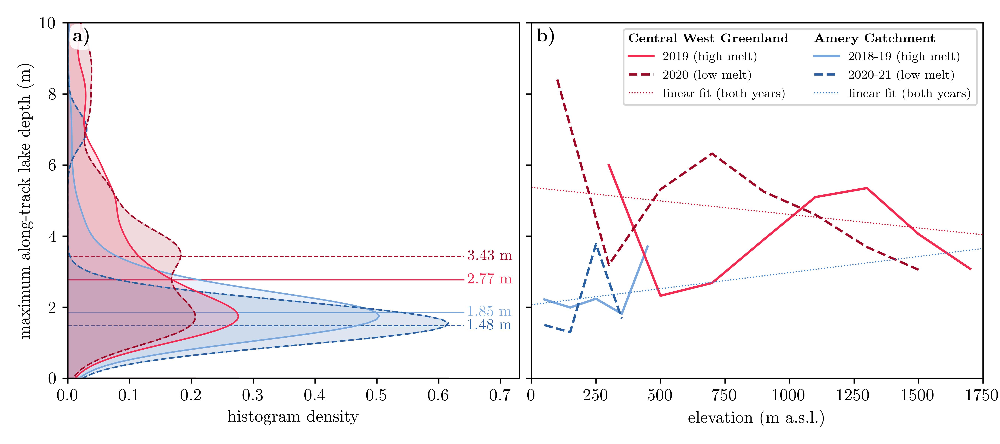

# Data and Code For FLUID-SuRRF Figures
For automatic supraglacial lake detection and depth determination in ICESAat-2 ATL03 data. 

## Fig. 1
notebook: [fig1-IS2-imagery-example.ipynb](fig01-ICESat2-imagery-example/fig1-IS2-imagery-example.ipynb)

## Fig. 2
made in [lucid](https://lucid.app/lucidchart/f86a9d24-7c33-4b07-829b-20f1b310e198/edit?viewport_loc=-4446%2C-360%2C6086%2C2602%2C0_0&invitationId=inv_ba6f5e48-edd5-4af5-a737-e423cf8edf99).

## Fig. 3
notebook: [fig3-flatness-check.ipynb](fig03-flatness-check/fig3-flatness-check.ipynb)

## Fig. 4
notebook: [fig4-afterpulses.ipynb](fig04-afterpulses/fig4-afterpulses.ipynb)

## Fig. 5
notebook: [fig5-density-signal-confidence.ipynb](fig05-density-signal-confidence/fig5-density-signal-confidence.ipynb)

## Fig. 6
notebook: [fig6-bathymetry-check.ipynb](fig06-bathymetry-check/fig6-bathymetry-check.ipynb)

## Fig. 7
notebook: [fig07-surf-explainer.ipynb](fig07-surrf-explainer/fig07-surf-explainer.ipynb)

## Fig. 8
notebook: [fig8-study-regions.ipynb](fig08-study-regions/fig8-study-regions.ipynb)

## Fig. 9
notebook: [figs9-10-results-maps.ipynb](fig09-10-results-maps/figs9-10-results-maps.ipynb)

## Fig. 10
notebook: [figs9-10-results-maps.ipynb](fig09-10-results-maps/figs9-10-results-maps.ipynb)

## Fig. 11
notebook: [fig11-depth-distributions.ipynb](fig11-depth-distributions/fig11-depth-distributions.ipynb)

## Fig. 12
notebook: [fig12-comparison-manual-estimates.ipynb](fig12-comparison-manual-estimates/fig12-comparison-manual-estimates.ipynb)

## Supplemental

photon counts by elevation relative to the surface return for saturated pulses by beam

